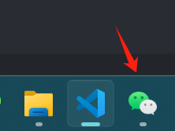

# 简介

微信自动聊天助手，借助AI帮助回复微信消息

# 🚀 快速开始

### 1. 环境要求

- Python 3.12
- Windows 10/11
- 微信桌面版3.9

### 2. 安装依赖

```bash
uv sync
```

### 3. 配置环境变量

复制 `.env.example` 为 `.env` 并配置：

```bash
cp .env.example .env
```

编辑 `.env` 文件：

VISION_MODEL_NAME 必须是多模态大模型，支持图片识别。MEMORY_MODEL_NAME 可与 CHAT_MODEL_NAME 共用。

```env
# LM Studio API 配置
CHAT_API_BASE=http://localhost:1234/v1
CHAT_API_KEY=lm-studio
CHAT_MODEL_NAME=qwen/qwen3.5-9b

VISION_API_BASE=http://localhost:1234/v1
VISION_API_KEY=lm-studio
VISION_MODEL_NAME=qwen3-vl-8b-instruct

MEMORY_API_BASE=http://localhost:1234/v1
MEMORY_API_KEY=not-needed
MEMORY_MODEL_NAME=qwen3-vl-8b-instruct
```

### 4. 生成长期记忆档案

从聊天记录中提取人物特征和关系，生成结构化记忆文件，辅助 AI 生成更贴切的回复。若不需要之前的记忆，可跳过。

准备工作：

根据 https://github.com/Sunldon/fork-WeChatMsg.git 导出微信聊天记录为 `wechat_cleaned.md`，放置于项目根目录。

执行命令生成记忆档案（结果在 `memory_files/{联系人}/` 目录下）：

```bash
# 从聊天记录生成（指定联系人名称）
uv run python parse_wechat.py --generate --user-id 张三

# 清空旧档案重新生成
uv run python parse_wechat.py --generate --user-id 张三 --reset
```

记忆以 Markdown 文件存储，每人一个目录，含 3 个分类：个人特征、喜好偏好、关系性事实。

### 5. 生成person人物性格

使用项目https://github.com/agenmod/immortal-skill.git 生成人物性格，放置在person目录下，当前目录结构

```

    目录: autoWechat\person
Mode                 LastWriteTime         Length Name                                             
----                 -------------         ------ ----                                             
-a----         2026/4/23     15:47           2407 interaction.md                                   
-a----         2026/4/23     15:48           1916 memory.md                                        
-a----         2026/4/23     15:47           2329 personality.md                                   
-a----         2026/4/23     15:48           3497 SKILL.md  
```

也可从 [永生.skill](https://agenworld.com/market) 市场获取现成的人物性格，或使用 nuwa-skill 蒸馏生成，放入 `person/` 目录。

### 6. 运行程序

**启动说明：**

需要提前打开微信，最小化在任务栏，而不是隐藏在右下角



配置联系人

在 `config.yaml` 中配置要监控的联系人：

```yaml
wechat:
  contacts:
    - "张三"
    - "李四"
```

修改姓名，让AI认识到用户姓名：

```
  user:
    name: "张三"       # 用户姓名
```

运行主程序：

```bash
# 使用长期记忆（推荐）
uv run python auto_wechat.py

# 不使用长期记忆
uv run python auto_wechat.py --no-history
```

若运行出现问题，可以按照下面的模块说明，逐步排查

若觉得回复风格不行，可以修改system_prompt_template.txt提示词。

## 模块说明

### 1. operate_wechat.py - 微信窗口操作模块

提供微信窗口控制、截图、消息发送等功能，指定联系人为张三

```
uv run python operate_Wechat.py --target 张三
```

查看当前目录下是否有debug_last_msg.png生成，该图片为与指定人员的微信聊天对话截图，不包含侧边栏的联系人.
如果聊天框截图不完整，或者是无法命中指定联系人，可以调整config.yaml的配置，如下所示

```
# 聊天区域截取配置
capture:
  left_offset: 300      # 左侧偏移量（跳过左侧联系人栏）
  top_offset: 90        # 顶部偏移量（跳过标题栏）
  bottom_offset: 205   # 底部偏移量（跳过输入栏）
search_position:
  x_offset: 150       # 搜索框相对于窗口左边的水平偏移
  y_offset: 40        # 搜索框相对于窗口顶部的垂直偏移
```

### 2. ai_analyse.py - AI 分析与对话模块

```
uv run python ai_analyse.py
```

根据debug_last_msg.png，让ai进行分析图片中的聊天内容，会生成以下内容：

```
当前消息结构:
{'text': 'xx', 'sender': 'self'}
{'text': 'yyy', 'sender': 'self'}
{'text': 'aaa', 'sender': 'other'}
{'text': 'bbbb', 'sender': 'self'}
```

若最后一条消息sender是other，则会将消息发送给ai，让ai进行回复

## 数据流

```
屏幕截图 → operate_wechat.py (capture_chat_area)
         ↓
      ai_analyse.py (ai_get_messages)
      调用 Qwen3-VL (LM Studio) 解析聊天界面 → JSON 消息列表
         ↓
      memory_manager.py (read_context)
      文件记忆 + LLM 选择器检索相关长期记忆
         ↓
      ai_analyse.py (chat_with_digital_twin)
      调用 Qwen3.5-9b 生成符合人格的回复
         ↓
      operate_wechat.py (send_message_chinese)
      剪贴板 + Ctrl+V 发送文字
```

## ⚙️ 配置文件说明

### config.yaml

主配置文件，采用 YAML 格式。

```yaml
# 微信自动化配置
wechat:
  window:
    width: 1000
    height: 800

  # 用户配置（本人信息）
  user:
    name: "张三"       # 用户姓名

  # 联系人列表
  contacts:
    - "李四"
    - "王五"

  # 消息监听配置
  monitor:
    base_sleep_time: 20  # 基础休眠时间（秒）
    max_sleep_time: 600  # 最大休眠时间（秒）
    retry_attempts: 3  # 消息发送重试次数

  # 聊天区域截取配置
  capture:
    left_offset: 300      # 左侧偏移量（跳过左侧联系人栏）
    top_offset: 90        # 顶部偏移量（跳过标题栏）
    bottom_offset: 205   # 底部偏移量（跳过输入栏）
# LM Studio / Qwen3-VL 模型配置
# 聊天模型配置
chat_model:
  api_base: "http://localhost:1234/v1"  # 修正URL格式
  api_key: "lm-studio"
  model_name: "qwen/qwen3.5-9b"
  max_tokens: 10240
  temperature: 0.7

# 视觉模型配置（用于图片解析）
vision_model:
  api_base: "http://localhost:1234/v1"          # 视觉模型 API 地址
  api_key: "lm-studio"                          # 视觉模型 API 密钥
  model_name: "qwen3-vl-8b-instruct"            # 视觉模型名称（支持视觉的多模态模型）
  max_tokens: 4096                              # 最大输出长度

# 记忆模块（文件存储）
memory:
  enabled: true
  llm:
    model: "qwen3-vl-8b-instruct"
    openai_base_url: "http://localhost:1234/v1"
    api_key: "not-needed"
  file_memory:
    path: "./memory_files"
    max_lines: 60         # 单分类文件最大行数，超出由 LLM 压缩合并
  search:
    top_k: 5

# 调试配置
debug:
  screenshot_path: "debug_last_msg.png"
```

### .env 环境变量

优先级高于 config.yaml 的环境变量配置。CHAT_MODEL_NAME可以和VISION_MODEL_NAME一样。

```env
# 聊天模型（生成回复）
CHAT_API_BASE=http://localhost:1234/v1
CHAT_API_KEY=lm-studio
CHAT_MODEL_NAME=qwen/qwen3.5-9b

# 视觉模型（解析微信截图）
VISION_API_BASE=http://localhost:1234/v1
VISION_API_KEY=lm-studio
VISION_MODEL_NAME=qwen3-vl-8b-instruct

# 记忆模型（提取+合并+检索）
MEMORY_API_BASE=http://localhost:1234/v1
MEMORY_API_KEY=not-needed
MEMORY_MODEL_NAME=qwen3-vl-8b-instruct
```

**说明：** `.env` 中的配置会覆盖 `config.yaml` 中的对应配置。

### 配置优先级

1. `.env` 环境变量（最高）
2. `config.yaml` 文件配置
3. 代码默认值（最低）

## 📄 许可证

MIT License

## 🤝 贡献

欢迎提交 Issue 和 Pull Request！
